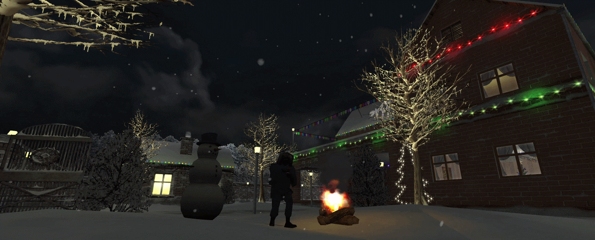

## ❄ Snow Wars 🇺🇦


*Built with [📦 AMXXPack](https://github.com/Hedgefog/node-amxxpack) and [🛠️ AMXX Modding Kit](https://github.com/Hedgefog/amxx-modding-kit)*

### 📄 About

__Snow Wars__ is a __Counter-Strike__ server-side modification that brings snowball fights to classic Counter-Strike modes with atmospheric and fun gameplay.

### 🔽 Download latest:
- [Releases](../../releases)

### 🔄 Requirements
- [Metamod-R](https://github.com/theAsmodai/metamod-r) + [ReHLDS](https://github.com/dreamstalker/rehlds) or [Metamod-P](https://github.com/Bots-United/metamod-p)
- [RegameDLL](https://github.com/s1lentq/ReGameDLL_CS)
- [Amx Mod X 1.9.0+](https://www.amxmodx.org/downloads-new.php)
- [ReAPI](https://github.com/s1lentq/reapi)

### 🔧 Deployment
- Clone repository.
- Install dependencies `npm i`

#### Customize builder
Use `.amxxpack.json` configuration file

#### Build project

```bash
npm run build
```

#### Watch project

```bash
npm run watch
```

#### Create bundle

```bash
npm run pack
```
